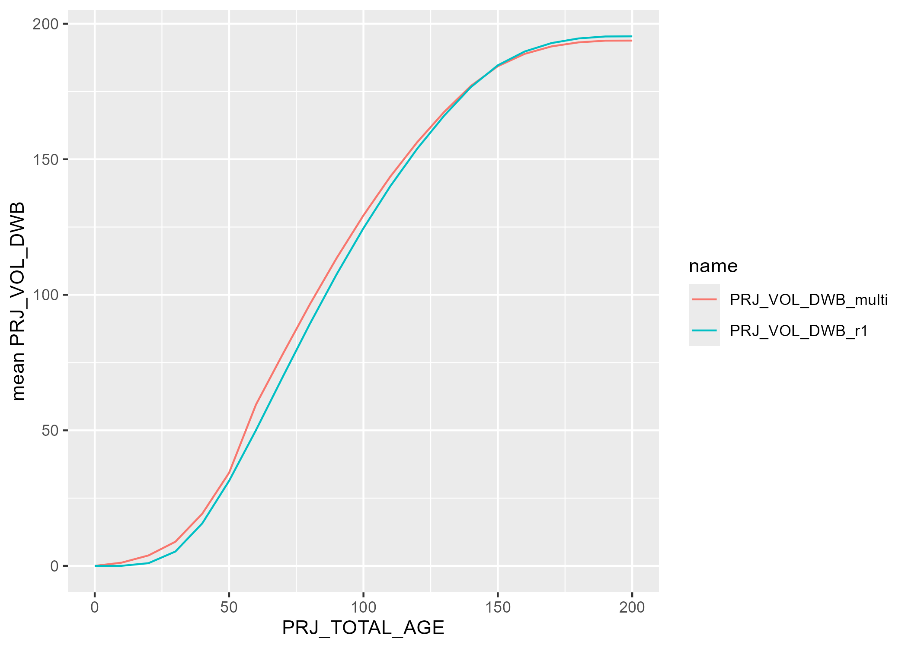
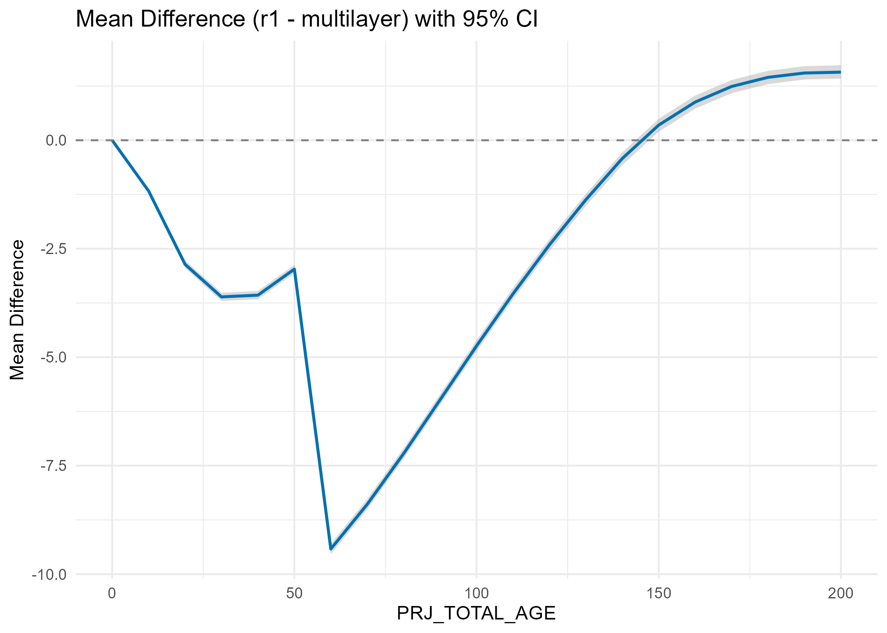
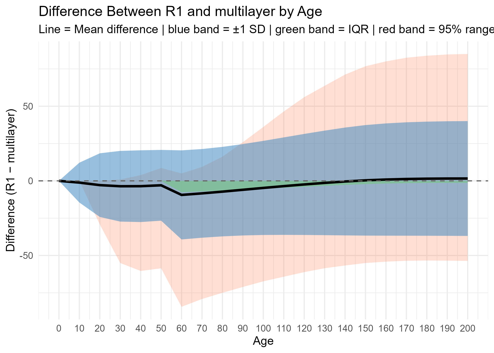
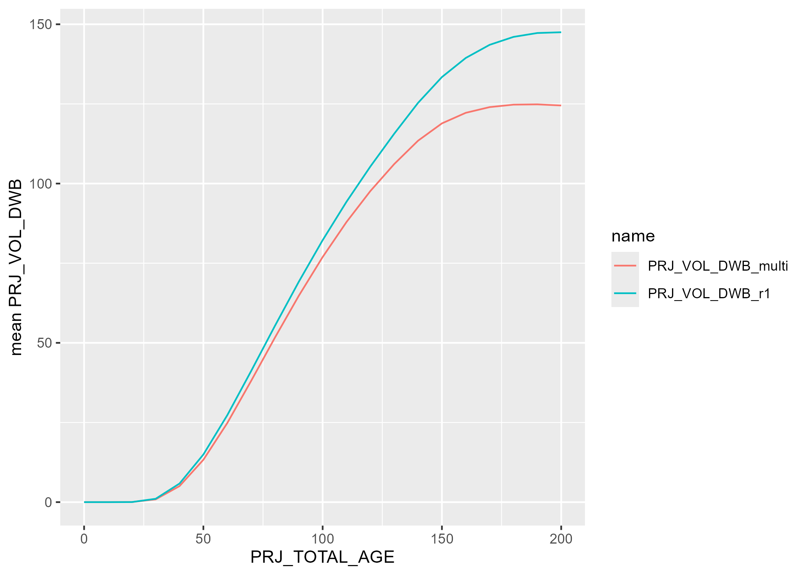
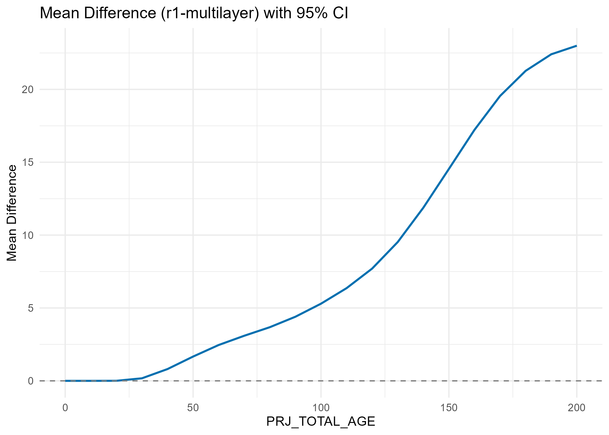
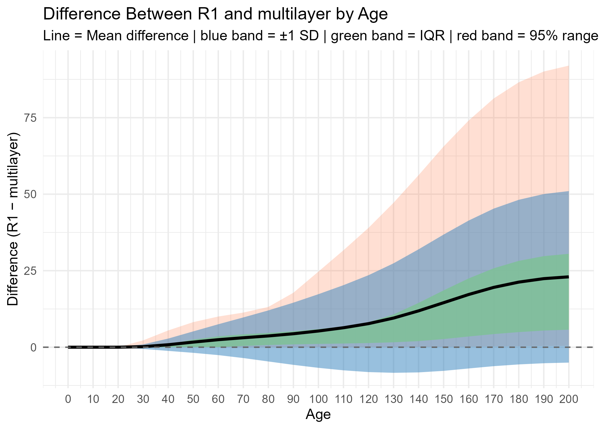

# comparison with combined mulitple layers' projection

Some of the VRI polygons contain multiple layers, for example, a polygon might have a primary layer (also labeled as R1 layer) and a residual layer. VDYP7 can projected these polygons by each of the layer and return yield projection for each layer within each polygon. The final yield of each polygon is the summarized projection of each layer to the polygon level. For the process of provincial NSYT, only R1 layer was input into VDYP and being projected. This chapter is to compare the summarized projection of each layer with the R1 layer only projection.

**numbers multi-layer polygons across the province (from vdyp_input_layer_and_polygon_2024)** 
```{r tab-summary_prov,echo=FALSE, warning=FALSE, message=FALSE}
tab <- readRDS("data/tables/tab-summary_prov.rds")

knitr::kable(
  tab
)

```
"multilayer" means the polygon has P layer and at least one other layer that is not D layer;
"P_and_D" means the polygon only has P layer and D layer

## set1. r1 only vs multilayer set1 (containing P layer and at least one other layer that is not D layer)

Number of multi-layer polygons that were included in this comparison: **239198**

1. mean proj_vol_dwb by projected age

```{r fig-set1_meanvol,echo=FALSE, warning=FALSE, message=FALSE, out.width="70%"}

```

2. mean differences and variation of proj_vol_dwb by projected age

```{r fig-set1_diff,echo=FALSE, warning=FALSE, message=FALSE,out.width="70%"}


```


## set2. r1 only vs multilayer set2 (only containing P layer and D layer)

Number of multi-layer polygons that were included in this comparison: **811118**

1. mean proj_vol_dwb by projected age

```{r fig-set2_meanvol, echo=FALSE, warning=FALSE, message=FALSE, out.width="70%"}

```

2. mean differences and variation of proj_vol_dwb by projected age

```{r fig-set2_diff, echo=FALSE, warning=FALSE, message=FALSE, out.width="70%"}


```

## Overall - one-layer polygons + muliple-layer polygons (set1+set2)

mean proj_vol_dwb after combining all polygons

```{r fig-prov_diff, echo=FALSE, warning=FALSE, message=FALSE, out.width="70%"}

```

statistic summary table of all polygons

```{r tab-comp_prov, echo=FALSE, warning=FALSE, message=FALSE}
tab <- readRDS("data/tables/tab-comp_prov.rds") 

knitr::kable(
  tab) %>%
 kable_styling(full_width = TRUE,
               font_size = 10)


```
